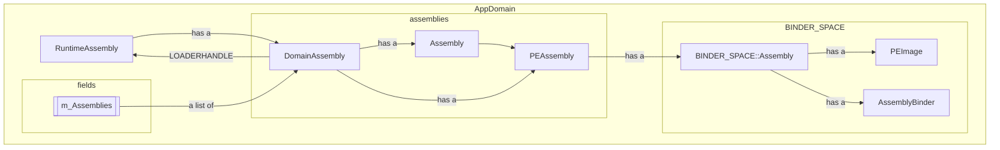
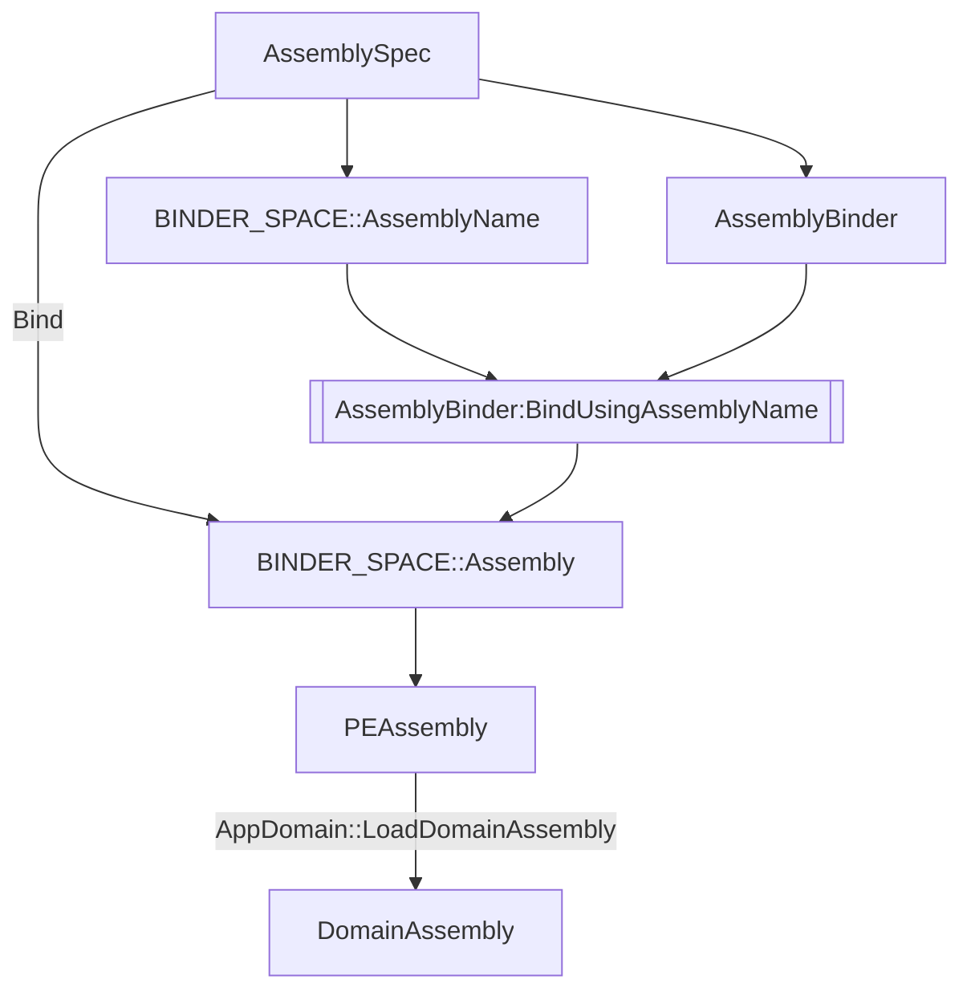

Notes:
- PEAssembly vs DomainAssembly:
  没有确切分析，但是根据后面的一些竞争条件下的分析，PEImage是和路径绑定的，所以PEAssembly也是和路径绑定的，及不同路径得到不同的PEAssembly，但是在publish到domain的时候，由于存在等价判断（其中一个就是simple name + culture + Module.MVID）,当完全等价的时候，多个PEAssembly对应的DomainAssembly会是同一个。

唯一性:
- BINDER_SPACE::Assembly (scope: binder>assembly name)
  name -> BINDER_SPACE::Assembly // 这个关系是每个binder维护一份，所以每个 binder+name 对应一个
  assembly name考虑的成分包括：simple name + culture
- PEImage (scope: exe>path)
  因为存在全局的static cache所以除非指定，否则是根据path对应到同一个的

顺序：
1. PEImage (CreateFile)
2. BINDER_SPACE::Assembly (check name of Assembly#1(TestCandidateRefMatchesDef), version(IsCompatibleAssemblyVersion))
3. PEAssembly
4. incremental load DomainAssembly (AppDomain::TryIncrementalLoad)
   - create Assembly

## AssemblyLoadContext
https://github.com/dotnet/runtime/blob/main/docs/design/features/unloadability.svg
注意图中`AssemblyLoaderAllocator`到`LoaderAllocator`的weak handle应该是一个long weak handle来保证`AssemblyLoaderAllocator`可以验证`LoaderAllocator`完成被收集从而保证unload顺序的正确性，见scout的注释。
第二点是途中RuntimeAssembly的引用，

对应native code下的一个`AssemblyBinder`
Default 对应的是 m_pTheAppDomain->m_pDefaultBinder
其他的对应的是 CustomAssemblyBinder
`AssemblyBinder` 拥有一个 GCHandle (long weak or strong) to `AssemblyLoadContext`
对于collectable的`AssemblyLoadContext`，会有创建一个`AssemblyLoaderAllocator`以及其对应的manged `LoaderAllocator` + `LoaderAllocatorScout`

## Assembly
- architecture: 从dll的pe kind和machine中计算得到
  要求为none/msil/和runtime相同
- public key会被校验吗？如何校验

## Dynamic Assembly
- PEAssembly->m_pHostAssembly == null
  PEAssembly->m_PEImage == null
  PEAssembly->m_pEmitter != null

## Cache
1. AppDomain有一个 spec -> PEAssembly/DomainAssembly 的map
   - 对于LoadFromAssemblyPath也会也到这个cache里面，但是其code path本身不读取这个cache
   - 注意，由于后续竞争(PEAssembly->DomainAssembly, publish时)的存在，以及不同spec由于cache会得到不同的PEAssembly，这个cache里面得到的PEAssembly是有可能是竞争失败的。但是注意PEAssembly对应的BINDER_SPACE::Assembly是相同的，而DomainAssembly是attach到其上面，所以最终LoadDomainAssembly的时候会返回正确的DomainAssembly。
     这里也揭示了一些PEAssembly和DomainAssembly的区别。
2. 每个Binder有一个 simple name + culture -> BINDER_SPACE::Assembly 的map

## TODO
ALC.LoadFromAssemblyPath
  - pitfalls: 当load CoreLib 和 TPA 中的 simple name 的时候，前者会直接挂，后者会吞到返回TPA结果
  - 对于不同路径的文件，判断相同的逻辑是 simple name + culture + Module#1->Mvid 相同。对相同的时候会根据竞争返回同一个获胜的assembly。
    换句话说，如果只是简单的名字相同，会报错，但是如果MVID也相同，不会报错，会返回同一个assembly。(我猜测是对应于说如果我复制一个文件到不同的路径下，我使用不同路径load是被允许得到相同的assembly的)
ALC.LoadFromAssemblyName return assembly with alc of this
  - PEAssembly比我想得还要广泛，不同spec都会有一个PEAssembly尽管resolve到相同的DomainAssembly
ALC.LoadFromAssemblyName return assembly with alc of others
  - 这个情况下，因为 `AppDomain::BindAssemblySpec` 中的 `SetBinder` 的逻辑，导致 domain 的 spec->PEAssembly 的cache无法生效，每次都会去执行创建的逻辑（包括`AssemblyLoadContext.Load`等），然后在`SetBinder`之后，新生成的PEAssembly又会被drop因为cache竞争失败。
  - 其它的区别似乎不大。
reflection emit assembly
  特殊的PEAssembly, m_PEImage, m_pHostAssembly == null, m_pEmitter != null